# Jarkom-Modul-2-2026-K-24

## Member   

| Nama                      | NRP        |
| ------------------------- | ---------- |
| Wildan Alfarezy       | 5027251088 |
| Ashkhabil Abror Budihardjo | 5027251049 |

## Laporan

1. Pertama kita melakukan setup topology nya terlebbih dahulu mulai dari rootkit lalu lima gerbang utama (Switch), operator (alpha, beta, gamma), penjaga directory (prab, tedd), gerbang penyaring (abbey, penny), hingga repository (obladi, desmond, oblada, molly).


2. Setelah itu melakukan Konfigurasikan NAT agar dapat meneruskan lalu lintas keluar bagi seluruh alamat internal, sehingga semua host di dalam jaringan dapat menjangkau internet publik menggunakan IP address. dengan membuat script di `config.sh` 

rootkit:
```sh
#!/bin/bash

# 1. Pancing koneksi internet secara MANUAL (Bypass dhclient)
ip link set eth0 up
ip addr flush dev eth0
ip addr add 192.168.122.250/24 dev eth0
ip route add default via 192.168.122.1
echo "nameserver 8.8.8.8" > /etc/resolv.conf

# 2. Update server dan instal alat yang hilang (sekarang pasti bisa karena ada internet)
apt-get update
DEBIAN_FRONTEND=noninteractive apt-get install -y ifupdown isc-dhcp-client iptables iptables-persistent

# 3. Tulis konfigurasi IP permanen
cat <<EOF > /etc/network/interfaces
auto lo
iface lo inet loopback

# Antarmuka NAT (sekarang isc-dhcp-client sudah terinstal)
auto eth0
iface eth0 inet dhcp

# Antarmuka Klien (Gunakan Prefix IP Kelompokmu)
auto eth1
iface eth1 inet static
    address 192.223.1.1
    netmask 255.255.255.0

auto eth2
iface eth2 inet static
    address 192.223.2.1
    netmask 255.255.255.0

auto eth3
iface eth3 inet static
    address 192.223.3.1
    netmask 255.255.255.0

auto eth4
iface eth4 inet static
    address 192.223.4.1
    netmask 255.255.255.0

auto eth5
iface eth5 inet static
    address 192.223.5.1
    netmask 255.255.255.0
EOF

# 4. Restart jaringan menggunakan ifupdown yang baru diinstal
ifdown -a && ifup -a

# 5. Aktifkan Routing dan NAT
echo 1 > /proc/sys/net/ipv4/ip_forward
iptables -t nat -A POSTROUTING -o eth0 -j MASQUERADE
netfilter-persistent save

echo "Konfigurasi Rootkit Selesai!"
```
alpha:
```sh
#!/bin/bash
ip link set eth0 up
ip addr flush dev eth0
ip addr add 192.223.4.2/24 dev eth0
ip route add default via 192.223.4.1
echo "nameserver 192.168.122.1" > /etc/resolv.conf

apt-get update
DEBIAN_FRONTEND=noninteractive apt-get install -y ifupdown

cat <<EOF > /etc/network/interfaces
auto lo
iface lo inet loopback

auto eth0
iface eth0 inet static
    address 192.223.4.2
    netmask 255.255.255.0
    gateway 192.223.4.1
EOF
echo "Konfigurasi alpha selesai!"
```
beta:
```sh
#!/bin/bash
ip link set eth0 up
ip addr flush dev eth0
ip addr add 192.223.4.3/24 dev eth0
ip route add default via 192.223.4.1
echo "nameserver 192.168.122.1" > /etc/resolv.conf

apt-get update
DEBIAN_FRONTEND=noninteractive apt-get install -y ifupdown

cat <<EOF > /etc/network/interfaces
auto lo
iface lo inet loopback

auto eth0
iface eth0 inet static
    address 192.223.4.3
    netmask 255.255.255.0
    gateway 192.223.4.1
EOF
echo "Konfigurasi beta selesai!"
```
gamma:
```sh
#!/bin/bash
ip link set eth0 up
ip addr flush dev eth0
ip addr add 192.223.4.4/24 dev eth0
ip route add default via 192.223.4.1
echo "nameserver 192.168.122.1" > /etc/resolv.conf

apt-get update
DEBIAN_FRONTEND=noninteractive apt-get install -y ifupdown

cat <<EOF > /etc/network/interfaces
auto lo
iface lo inet loopback

auto eth0
iface eth0 inet static
    address 192.223.4.4
    netmask 255.255.255.0
    gateway 192.223.4.1
EOF
echo "Konfigurasi gamma selesai!"
```
delta:
```sh
#!/bin/bash
ip link set eth0 up
ip addr flush dev eth0
ip addr add 192.223.5.2/24 dev eth0
ip route add default via 192.223.5.1
echo "nameserver 192.168.122.1" > /etc/resolv.conf

apt-get update
DEBIAN_FRONTEND=noninteractive apt-get install -y ifupdown

cat <<EOF > /etc/network/interfaces
auto lo
iface lo inet loopback

auto eth0
iface eth0 inet static
    address 192.223.5.2
    netmask 255.255.255.0
    gateway 192.223.5.1
EOF
echo "Konfigurasi delta selesai!"
```
epsilon:
```sh
#!/bin/bash
ip link set eth0 up
ip addr flush dev eth0
ip addr add 192.223.5.3/24 dev eth0
ip route add default via 192.223.5.1
echo "nameserver 192.168.122.1" > /etc/resolv.conf

apt-get update
DEBIAN_FRONTEND=noninteractive apt-get install -y ifupdown

cat <<EOF > /etc/network/interfaces
auto lo
iface lo inet loopback

auto eth0
iface eth0 inet static
    address 192.223.5.3
    netmask 255.255.255.0
    gateway 192.223.5.1
EOF
echo "Konfigurasi epsilon selesai!"
```
abbey:
```sh
#!/bin/bash
ip link set eth0 up
ip addr flush dev eth0
ip addr add 192.223.2.2/24 dev eth0
ip route add default via 192.223.2.1
echo "nameserver 192.168.122.1" > /etc/resolv.conf

apt-get update
DEBIAN_FRONTEND=noninteractive apt-get install -y ifupdown

cat <<EOF > /etc/network/interfaces
auto lo
iface lo inet loopback

auto eth0
iface eth0 inet static
    address 192.223.2.2
    netmask 255.255.255.0
    gateway 192.223.2.1
EOF
echo "Konfigurasi abbey selesai!"
```
penny:
```sh
#!/bin/bash
ip link set eth0 up
ip addr flush dev eth0
ip addr add 192.223.3.2/24 dev eth0
ip route add default via 192.223.3.1
echo "nameserver 192.168.122.1" > /etc/resolv.conf

apt-get update
DEBIAN_FRONTEND=noninteractive apt-get install -y ifupdown

cat <<EOF > /etc/network/interfaces
auto lo
iface lo inet loopback

auto eth0
iface eth0 inet static
    address 192.223.3.2
    netmask 255.255.255.0
    gateway 192.223.3.1
EOF
echo "Konfigurasi penny selesai!"
```
prab:
```sh
#!/bin/bash
ip link set eth0 up
ip addr flush dev eth0
ip addr add 192.223.1.2/24 dev eth0
ip route add default via 192.223.1.1
echo "nameserver 192.168.122.1" > /etc/resolv.conf

apt-get update
DEBIAN_FRONTEND=noninteractive apt-get install -y ifupdown

cat <<EOF > /etc/network/interfaces
auto lo
iface lo inet loopback

auto eth0
iface eth0 inet static
    address 192.223.1.2
    netmask 255.255.255.0
    gateway 192.223.1.1
EOF
echo "Konfigurasi prab selesai!"
```
tedd:
```sh
#!/bin/bash
ip link set eth0 up
ip addr flush dev eth0
ip addr add 192.223.1.3/24 dev eth0
ip route add default via 192.223.1.1
echo "nameserver 192.168.122.1" > /etc/resolv.conf

apt-get update
DEBIAN_FRONTEND=noninteractive apt-get install -y ifupdown

cat <<EOF > /etc/network/interfaces
auto lo
iface lo inet loopback

auto eth0
iface eth0 inet static
    address 192.223.1.3
    netmask 255.255.255.0
    gateway 192.223.1.1
EOF
echo "Konfigurasi tedd selesai!"
```
obladi:
```sh
#!/bin/bash
ip link set eth0 up
ip addr flush dev eth0
ip addr add 192.223.1.4/24 dev eth0
ip route add default via 192.223.1.1
echo "nameserver 192.168.122.1" > /etc/resolv.conf

apt-get update
DEBIAN_FRONTEND=noninteractive apt-get install -y ifupdown

cat <<EOF > /etc/network/interfaces
auto lo
iface lo inet loopback

auto eth0
iface eth0 inet static
    address 192.223.1.4
    netmask 255.255.255.0
    gateway 192.223.1.1
EOF
echo "Konfigurasi obladi selesai!"
```
desmond:
```sh
#!/bin/bash
ip link set eth0 up
ip addr flush dev eth0
ip addr add 192.223.1.5/24 dev eth0
ip route add default via 192.223.1.1
echo "nameserver 192.168.122.1" > /etc/resolv.conf

apt-get update
DEBIAN_FRONTEND=noninteractive apt-get install -y ifupdown

cat <<EOF > /etc/network/interfaces
auto lo
iface lo inet loopback

auto eth0
iface eth0 inet static
    address 192.223.1.5
    netmask 255.255.255.0
    gateway 192.223.1.1
EOF
echo "Konfigurasi desmond selesai!"
```
oblada:
```sh
#!/bin/bash
ip link set eth0 up
ip addr flush dev eth0
ip addr add 192.223.1.6/24 dev eth0
ip route add default via 192.223.1.1
echo "nameserver 192.168.122.1" > /etc/resolv.conf

apt-get update
DEBIAN_FRONTEND=noninteractive apt-get install -y ifupdown

cat <<EOF > /etc/network/interfaces
auto lo
iface lo inet loopback

auto eth0
iface eth0 inet static
    address 192.223.1.6
    netmask 255.255.255.0
    gateway 192.223.1.1
EOF
echo "Konfigurasi oblada selesai!"
```
molly:
```sh
#!/bin/bash
ip link set eth0 up
ip addr flush dev eth0
ip addr add 192.223.1.7/24 dev eth0
ip route add default via 192.223.1.1
echo "nameserver 192.168.122.1" > /etc/resolv.conf

apt-get update
DEBIAN_FRONTEND=noninteractive apt-get install -y ifupdown

cat <<EOF > /etc/network/interfaces
auto lo
iface lo inet loopback

auto eth0
iface eth0 inet static
    address 192.223.1.7
    netmask 255.255.255.0
    gateway 192.223.1.1
EOF
echo "Konfigurasi molly selesai!"
```
3. untuk soal nomer 3 kami sudah menjadikan satu script di soal dua tadi. jadi untuk menghindari fragmentasi saat persiapan, pastikan setiap host non-router menambahkan resolver 192.168.122.1 di tambah di file /etc/resolv.conf kami lakukan di `config.sh` pada setiap client.

pada tiap client:
```sh
echo "nameserver 192.168.122.1" > /etc/resolv.conf
```
4. Selanjutnya Pada node prab, bangun zona `<xxxx>.com` sebagai authoritative dengan SOA yang menunjuk ke `prab.<xxxx>.com`, serta tambahkan catatan NS untuk `prab.<xxxx>`.com dan`tedd.<xxxx>.com`. untuk `prab.<xxxx>.com` dan `tedd.<xxxx>.com` yang mengarah ke alamat IP mereka masing-masing sedangkan `<xxxx>.com` mengarah ke gerbang aplikasi dinamis (penny).

## langkah pertama kami lakukan konfigurasi di prab (master)

buat scrift dengan nama `nomer4.sh` di node prab:
```sh
#!/bin/bash

# 1. Instal aplikasi DNS Server (BIND9) dan alat pengujian
apt-get update
DEBIAN_FRONTEND=noninteractive apt-get install -y bind9 bind9utils bind9-doc dnsutils

# 2. Konfigurasi Forwarders ke 192.168.122.1
cat <<EOF > /etc/bind/named.conf.options
options {
        directory "/var/cache/bind";
        forwarders {
                192.168.122.1;
        };
        forward only;
        dnssec-validation auto;
        listen-on-v6 { any; };
        allow-query { any; };
};
EOF

# 3. Deklarasi Zona Master untuk k24.com
cat <<EOF > /etc/bind/named.conf.local
zone "k24.com" {
        type master;
        file "/etc/bind/db.k24";
        allow-transfer { 192.223.1.3; };  # Mengizinkan transfer ke IP tedd
        notify yes;
};
EOF

# 4. Membuat File Zona (Data Domain)
cat <<EOF > /etc/bind/db.k24
\$TTL    604800
@       IN      SOA     prab.k24.com. admin.k24.com. (
                              2026092901 ; Serial
                              604800     ; Refresh
                              86400      ; Retry
                              2419200    ; Expire
                              604800 )   ; Negative Cache TTL
;
@       IN      NS      prab.k24.com.
@       IN      NS      tedd.k24.com.
@       IN      A       192.223.3.2      ; Mengarah ke IP penny

prab    IN      A       192.223.1.2      ; IP milik prab
tedd    IN      A       192.223.1.3      ; IP milik tedd
EOF

# 5. Nyalakan layanan BIND9 langsung dari program intinya
/usr/sbin/named -u bind

# 6. Perbarui urutan resolver prab
cat <<EOF > /etc/resolv.conf
nameserver 192.223.1.2
nameserver 192.223.1.3
nameserver 192.168.122.1
EOF

echo "Konfigurasi prab sebagai Master DNS untuk k24.com selesai!"
```
## langkah kedua kami melakukan konfigurasi di tedd (slave)

buat scrift dengan nama `nomer4.sh` juga tapi di node tedd:
```sh
#!/bin/bash

# 1. Instal aplikasi DNS Server
apt-get update
DEBIAN_FRONTEND=noninteractive apt-get install -y bind9 bind9utils bind9-doc dnsutils

# 2. Konfigurasi Forwarders ke internet (192.168.122.1)
cat <<EOF > /etc/bind/named.conf.options
options {
        directory "/var/cache/bind";
        forwarders {
                192.168.122.1;
        };
        forward only;
        dnssec-validation auto;
        listen-on-v6 { any; };
        allow-query { any; };
};
EOF

# 3. Deklarasi Zona Slave yang disalin dari prab (Master)
cat <<EOF > /etc/bind/named.conf.local
zone "k24.com" {
        type slave;
        masters { 192.223.1.2; };        # Menunjuk ke IP milik prab
        file "/var/cache/bind/db.k24";   # Disimpan di sini agar sistem diizinkan menulis data salinan
};
EOF

# 4. Nyalakan layanan BIND9 langsung dari program intinya
/usr/sbin/named -u bind

# 5. Perbarui urutan resolver tedd agar bisa mengetes domain
cat <<EOF > /etc/resolv.conf
nameserver 192.223.1.2
nameserver 192.223.1.3
nameserver 192.168.122.1
EOF

echo "Konfigurasi tedd sebagai Slave DNS untuk k24.com selesai!"
```

setelah itu kita script untuk semua node selain prab dan tedd untuk perbarui urutan resolver pada seluruh Entitas non-router menjadi: IP prab, IP tedd, lalu 192.168.122.1.

```sh
#!/bin/bash

# Memperbarui urutan resolver untuk klien
cat <<EOF > /etc/resolv.conf
nameserver 192.223.1.2
nameserver 192.223.1.3
nameserver 192.168.122.1
EOF

echo "DNS Resolver klien berhasil diperbarui!"
```

lalu kami tes:


5. kami lanjut untuk menamai semua Entitas (hostname) sesuai glosarium: rootkit, alpha, beta, gamma, delta, epsilon, prab, tedd, abbey, penny, obladi, desmond, oblada, molly, dan verifikasi bahwa setiap host mengenali hostname tersebut secara system-wide. lalu kami membuat setiap domain untuk masing-masing node sesuai dengan namanya (contoh: alpha.<xxxx>.com) dan assign IP masing-masing juga. dilakukan kesemua kecuali untuk node yang bertanggung jawab atas prab dan tedd.

kami bikin script dengan nama `set_hostname.sh` untuk menamai hostname:

```sh
#!/bin/bash
echo "prab" > /etc/hostname
echo "127.0.1.1 prab" >> /etc/hosts
hostname prab
echo "Hostname prab siap!"
```

Setelah itu kami buat scipt `nomer5.sh` untuk agar mempunyai domain masing-masing:

```sh
#!/bin/bash
sed -i 's/2026092901/2026092902/g' /etc/bind/db.k24

echo "rootkit IN A 192.223.1.1" >> /etc/bind/db.k24
echo "alpha   IN A 192.223.4.2" >> /etc/bind/db.k24
echo "beta    IN A 192.223.4.3" >> /etc/bind/db.k24
echo "gamma   IN A 192.223.4.4" >> /etc/bind/db.k24
echo "delta   IN A 192.223.5.2" >> /etc/bind/db.k24
echo "epsilon IN A 192.223.5.3" >> /etc/bind/db.k24
echo "abbey   IN A 192.223.2.2" >> /etc/bind/db.k24
echo "penny   IN A 192.223.3.2" >> /etc/bind/db.k24
echo "obladi  IN A 192.223.1.4" >> /etc/bind/db.k24
echo "desmond IN A 192.223.1.5" >> /etc/bind/db.k24
echo "oblada  IN A 192.223.1.6" >> /etc/bind/db.k24
echo "molly   IN A 192.223.1.7" >> /etc/bind/db.k24

pkill named
/usr/sbin/named -u bind
```

lalu kami tes untuk melakukan ping salah satu entitas:


6. kami memastikan bahwa tedd telah menerima salinan zona terbaru dari prab. jadi nilai SOA di keduanya harus sama. 

kita lakukan `dig` dan opsi `+short` pada node prab:

```sh
dig @192.223.1.2 k24.com SOA +short
```

lalu lakukan `dig` dan opsi `+short` juga pada node tedd:

```sh
dig @192.223.1.3 k24.com SOA +short
```

hasilnya keduanya memunculkan hal yang sama persis:


7. abbey dan penny sebagai gerbang utama, obladi dan desmond sebagai web statis, oblada dan molly sebagai web dinamis. Tambahkan pada zona k24.com A record untuk vault.k24.com (IP obladi & desmond), dan core.k24.com (IP oblada & molly). Tetapkan CNAME:
- www.k24.com → penny.k24.com
- static.k24.com → abbey.k24.com
Verifikasi dari dua klien berbeda bahwa seluruh hostname tersebut ter-resolve ke tujuan yang benar dan konsisten.

Kami menetapkan konfigurasi record sebagai berikut:

**1. A Record:**
- `vault.k24.com` memetakan ke IP dari **obladi** dan **desmond** (melayani web statis).
- `core.k24.com` memetakan ke IP dari **oblada** dan **molly** (melayani web dinamis).

**2. CNAME Record:**
- `www.k24.com` sebagai alias untuk `penny.k24.com` (salah satu gerbang utama).
- `static.k24.com` sebagai alias untuk `abbey.k24.com` (salah satu gerbang utama).

kami buat script `nomer7.sh` di node prab:

```sh
#!/bin/bash

# Menaikkan nilai Serial SOA agar tedd tersinkronisasi
sed -i 's/2026092902/2026092903/g' /etc/bind/db.k24

# Menambahkan A record untuk vault dan core (Round-Robin IP)
echo "vault   IN      A       192.223.1.4" >> /etc/bind/db.k24
echo "vault   IN      A       192.223.1.5" >> /etc/bind/db.k24
echo "core    IN      A       192.223.1.6" >> /etc/bind/db.k24
echo "core    IN      A       192.223.1.7" >> /etc/bind/db.k24

# Menambahkan CNAME record untuk www dan static
echo "www     IN      CNAME   penny.k24.com." >> /etc/bind/db.k24
echo "static  IN      CNAME   abbey.k24.com." >> /etc/bind/db.k24

# Restart layanan BIND9
pkill named
/usr/sbin/named -u bind
```

lalu kami melakukan validasi dengan menggunakan perintah `dig` dan opsi `+short`:

```sh
dig vault.k24.com +short
dig core.k24.com +short
dig www.k24.com +short
dig static.k24.com +short
```

hasil:


8. Kami menetapkan konfigurasi Reverse DNS (PTR Record) dengan arsitektur Master-Slave sebagai berikut:

a. Di node Prab (Master):
Mendeklarasikan 3 reverse zone untuk masing-masing subnet dan menambahkan PTR record agar IP mengarah kembali ke hostname yang benar.

b. Di node Tedd (Slave):
Mendeklarasikan 3 reverse zone yang sama dengan tipe `slave` untuk menarik data zona secara otomatis dari node prab.

kami buat script `nomer8_master.sh` di node prab:

```sh
#!/bin/bash

# Tambahkan deklarasi reverse zone ke named.conf.local
cat <<EOF >> /etc/bind/named.conf.local

zone "1.223.192.in-addr.arpa" {
        type master;
        file "/var/cache/bind/db.192.223.1";
        allow-transfer { 192.223.1.3; };
};

zone "2.223.192.in-addr.arpa" {
        type master;
        file "/var/cache/bind/db.192.223.2";
        allow-transfer { 192.223.1.3; };
};

zone "3.223.192.in-addr.arpa" {
        type master;
        file "/var/cache/bind/db.192.223.3";
        allow-transfer { 192.223.1.3; };
};
EOF

# Buat file reverse zone untuk subnet 1.223.192 (untuk obladi, desmond, oblada, molly)
cat <<EOF > /var/cache/bind/db.192.223.1
$TTL    604800
@       IN      SOA     prab.k24.com. root.k24.com. (
                              2026092901
                              604800
                              86400
                              2419200
                              604800 )
@       IN      NS      prab.k24.com.
4       IN      PTR     obladi.k24.com.
5       IN      PTR     desmond.k24.com.
6       IN      PTR     oblada.k24.com.
7       IN      PTR     molly.k24.com.
EOF

# Buat file reverse zone untuk subnet 2.223.192 (untuk abbey)
cat <<EOF > /var/cache/bind/db.192.223.2
$TTL    604800
@       IN      SOA     prab.k24.com. root.k24.com. (
                              2026092901
                              604800
                              86400
                              2419200
                              604800 )
@       IN      NS      prab.k24.com.
2       IN      PTR     abbey.k24.com.
EOF

# Buat file reverse zone untuk subnet 3.223.192 (untuk penny)
cat <<EOF > /var/cache/bind/db.192.223.3
$TTL    604800
@       IN      SOA     prab.k24.com. root.k24.com. (
                              2026092901
                              604800
                              86400
                              2419200
                              604800 )
@       IN      NS      prab.k24.com.
2       IN      PTR     penny.k24.com.
EOF

# Restart BIND9
pkill named
/usr/sbin/named -u bind
```

dan kami buat script `nomer8_slave.sh` di node tedd:

```sh
#!/bin/bash

# Tambahkan deklarasi slave reverse zone ke named.conf.local
cat <<EOF >> /etc/bind/named.conf.local

zone "1.223.192.in-addr.arpa" {
        type slave;
        masters { 192.223.1.2; };
        file "/var/cache/bind/db.192.223.1";
};

zone "2.223.192.in-addr.arpa" {
        type slave;
        masters { 192.223.1.2; };
        file "/var/cache/bind/db.192.223.2";
};

zone "3.223.192.in-addr.arpa" {
        type slave;
        masters { 192.223.1.2; };
        file "/var/cache/bind/db.192.223.3";
};
EOF

# Restart BIND9 di tedd
pkill named
/usr/sbin/named -u bind
```

lalu kami melakukan validasi reverse lookup menggunakan perintah host dari node klien untuk memastikan IP mengembalikan hostname yang benar:

1. untuk vault dan core:

```sh
host -t ptr 192.223.1.4
host -t ptr 192.223.1.5
host -t ptr 192.223.1.6
host -t ptr 192.223.1.7
```

2. untuk abbey dan penny:

```sh
host -t ptr 192.223.2.2
host -t ptr 192.223.3.2
```

hasilnya:


9. Kami menetapkan konfigurasi layanan web statis dengan fitur autoindex (Directory Listing) pada node vault sebagai berikut:

Di node obladi dan desmond (Vault):
Menginstal web server Apache2, membuat `direktori /arsip`, dan mengatur konfigurasi VirtualHost dengan ServerName `vault.k24.com`. Kami juga menambahkan direktif Options Indexes agar isi direktori dapat ditelusuri langsung dari browser ketika diakses melalui hostname.

kami buat script `nomer9.sh` di node obladi dan desmond:

```sh
#!/bin/bash
apt-get update
apt-get install -y apache2

mkdir -p /arsip

cat <<EOF > /etc/apache2/sites-available/arsip.conf
<VirtualHost *:80>
    ServerName vault.k24.com
    DocumentRoot /arsip

    <Directory /arsip>
        Options Indexes FollowSymLinks
        AllowOverride None
        Require all granted
    </Directory>
</VirtualHost>
EOF

a2ensite arsip.conf
a2dissite 000-default.conf

# Restart menggunakan apachectl / eksekusi daemon langsung
apachectl -k stop
apachectl -k start
```

lalu kami melakukan validasi dari node klien untuk menguji akses directory listing web statis menggunakan perintah `curl` (atau web browser teks seperti `lynx`) dengan memanggil hostname:

```sh
curl http://vault.k24.com/
curl http://vault.k24.com/arsip/
```

hasilnya:


10. Kami mengonfigurasi layanan web dinamis (PHP-FPM) menggunakan Nginx pada node core sebagai berikut:

Di node oblada dan molly (Core):
Membersihkan sisa layanan Apache2 untuk menghindari konflik di port 80, kemudian menginstal Nginx dan PHP-FPM. Kami menyiapkan direktori web dan membuat aplikasi sederhana berupa halaman beranda `(index.php)` serta halaman profil `(profil.php)`. Selanjutnya, kami membuat konfigurasi Nginx dengan `server_name core.k24.com` dan menerapkan aturan URL Rewrite `(rewrite ^ /profil.php last;)` agar akses ke URL `/profil` dapat memuat halaman profil secara bersih tanpa menuliskan akhiran `.php`.

kami buat script `nomer10.sh` di node oblada dan molly:

```sh
#!/bin/bash

# 1. Bersihkan Apache agar tidak bentrok di port 80
service apache2 stop 2>/dev/null
killall -9 apache2 2>/dev/null
apt-get remove --purge -y apache2* 2>/dev/null
rm -rf /var/www/html/index.html

# 2. Update repo dan pasang Nginx serta PHP-FPM
apt-get update
apt-get install -y nginx php-fpm

# 3. Deteksi versi PHP yang terpasang di sistem
PHP_VER=$(php -v | head -n 1 | cut -d " " -f 2 | cut -d "." -f 1,2)

# Pastikan layanan PHP-FPM menyala agar socket-nya siap
service php${PHP_VER}-fpm restart

# 4. Siapkan folder web dan file aplikasi sederhana
mkdir -p /var/www/core

cat <<'EOF' > /var/www/core/index.php
<?php
echo "Hello Core";
?>
EOF

cat <<'EOF' > /var/www/core/profil.php
<?php
echo "About Core";
?>
EOF

# 5. Buat konfigurasi Nginx beserta aturan URL Rewrite untuk /profil
cat <<EOF > /etc/nginx/sites-available/core.conf
server {
    listen 80;
    server_name core.k24.com;
    root /var/www/core;

    index index.php index.html;

    location / {
        try_files \$uri \$uri/ =404;
    }

    # Aturan URL Rewrite agar /profil mengarah ke /profil.php
    location = /profil {
        rewrite ^ /profil.php last;
    }

    location ~ \.php\$ {
        include snippets/fastcgi-php.conf;
        fastcgi_pass unix:/run/php/php${PHP_VER}-fpm.sock;
    }
}
EOF

# 6. Aktifkan vhost core dan matikan konfigurasi default
ln -sf /etc/nginx/sites-available/core.conf /etc/nginx/sites-enabled/
rm -f /etc/nginx/sites-enabled/default

# 7. Restart Nginx dan PHP-FPM
service nginx restart
service php${PHP_VER}-fpm restart
```

lalu kami melakukan validasi dari node klien untuk menguji akses beranda dan halaman profil menggunakan perintah `curl`:

```sh
curl http://core.k24.com/
curl http://core.k24.com/profil
```

hasilnya:


11. Konfigurasikan Penny (menggunakan Apache) sebagai reverse proxy yang mengarah ke semua node di area vault (Obladi & Desmond). Sementara itu, konfigurasikan Abbey (menggunakan Nginx) sebagai reverse proxy menuju area core (Oblada & Molly). Pastikan kedua gerbang ini meneruskan identitas asli pengunjung ke server backend dengan melakukan forwarding header Host dan X-Real-IP. Buktikan bahwa Penny dan Abbey berhasil mendistribusikan lalu lintas dengan tepat.

Pertama kami membuat script konfigurasi untuk Penny menggunakan Apache.
```sh
#!/bin/bash
# Script Konfigurasi Penny sebagai Reverse Proxy Area Vault

# 1. Update repository dan pastikan apache2 terinstall
apt-get update
apt-get install -y apache2

# 2. Aktifkan modul apache yang dibutuhkan untuk reverse proxy & load balancer
a2enmod proxy proxy_http proxy_balancer lbmethod_byrequests headers

# 3. Buat file konfigurasi virtual host Apache
cat << 'EOF' > /etc/apache2/sites-available/000-default.conf
<VirtualHost *:80>
    ServerName penny.k24.com 

    <Proxy balancer://vault_cluster>
        BalancerMember http://obladi.k24.com
        BalancerMember http://desmond.k24.com
        ProxySet lbmethod=byrequests
    </Proxy>

    # Forwarding header identitas asli
    ProxyPreserveHost On
    RequestHeader set X-Real-IP "%{REMOTE_ADDR}s"

    ProxyPass / balancer://vault_cluster/
    ProxyPassReverse / balancer://vault_cluster/
</VirtualHost>
EOF

# 4. Restart service Apache2 agar konfigurasi diterapkan
service apache2 restart
echo "Konfigurasi Penny Selesai!"
```
Kemudian kami juga membuat script konfigurasi untuk Abbey menggunakan Nginx.
```sh
#!/bin/bash
# Script Konfigurasi Abbey sebagai Reverse Proxy Area Core

# 1. Update repository dan pastikan nginx terinstall
apt-get update
apt-get install -y nginx

# 2. Timpa konfigurasi default Nginx dengan blok reverse proxy
cat << 'EOF' > /etc/nginx/sites-available/default
upstream core_cluster {
    server oblada.k24.com;
    server molly.k24.com;
}

server {
    listen 80 default_server;
    listen [::]:80 default_server;
    
    server_name abbey.k24.com;

    location / {
        proxy_pass http://core_cluster;
        
        # Forwarding header identitas asli
        proxy_set_header Host $host;
        proxy_set_header X-Real-IP $remote_addr;
        proxy_set_header X-Forwarded-For $proxy_add_x_forwarded_for;
    }
}
EOF

# 3. Restart service Nginx agar konfigurasi diterapkan
service nginx restart
echo "Konfigurasi Abbey Selesai!"
```
Setelah semuanya terkonfigurasi, jalankan scriptnya pada terminal node Penny dan Abbey. Kemudian lakukan command `curl http://penny.k24.com` untuk domain milik penny dan `curl http://abbey.k24.com` untuk domain milik abbey. Dibawah ini adalah hasilnya.

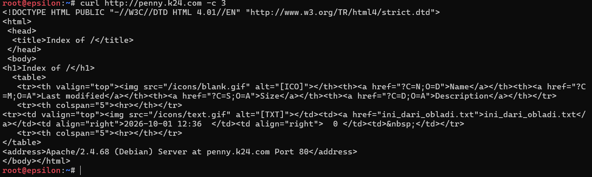
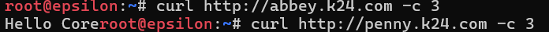
bisa dilihat pada gambar diatas untuk output dari penny adalah html dan output abbey adalah Hello Core.

12. Terdapat ruang khusus di penny yang yang menyimpan dokumen rahasia sindikat, oleh karena itu terapkan perlindungan basic authentication untuk path /admin. Akses ke jalur tersebut harus menolak pengunjung tanpa kredensial, dan hanya mengizinkan masuk jika menggunakan credential berikut:

|username          |password |
|------------------|---------|
|prabs   |pakar_pinter_jadi_gob***|

Pertama buat konfigurasi script di node penny agar hanya admin yang memiliki akses untuk membuka dokumen rahasia sindikat.
```sh
#!/bin/bash

# 1. Install apache2-utils untuk menggunakan perintah htpasswd
apt-get update
apt-get install -y apache2-utils

# 2. Buat direktori lokal untuk /admin dan isi dengan dokumen rahasia
mkdir -p /var/www/html/admin
echo "<h1>Dokumen Rahasia Sindikat</h1>" > /var/www/html/admin/index.html

# 3. Buat file kredensial .htpasswd (opsi -b untuk memasukkan password langsung di command, -c untuk create)
htpasswd -bc /etc/apache2/.htpasswd prabs "pakar_pinter_jadi_gob***"

# 4. Tulis ulang konfigurasi VirtualHost dengan penambahan autentikasi
cat << 'EOF' > /etc/apache2/sites-available/000-default.conf
<VirtualHost *:80>
    ServerName penny.k24.com 

    # --- KONFIGURASI SOAL 12 ---
    # Kecualikan path /admin agar tidak dikirim ke node area vault
    ProxyPass /admin !

    # Terapkan perlindungan Basic Authentication pada path /admin
    <Location /admin>
        AuthType Basic
        AuthName "Restricted Area"
        AuthUserFile /etc/apache2/.htpasswd
        Require valid-user
    </Location>
    # ---------------------------

    # --- KONFIGURASI SOAL 11 ---
    <Proxy balancer://vault_cluster>
        BalancerMember http://obladi.k24.com
        BalancerMember http://desmond.k24.com
        ProxySet lbmethod=byrequests
    </Proxy>

    ProxyPreserveHost On
    RequestHeader set X-Real-IP "%{REMOTE_ADDR}s"

    ProxyPass / balancer://vault_cluster/
    ProxyPassReverse / balancer://vault_cluster/
    # ---------------------------
</VirtualHost>
EOF

# 5. Restart service Apache2 agar konfigurasi diterapkan
service apache2 restart
echo "Konfigurasi Basic Auth untuk /admin selesai!"
```
Kemudian tinggal jalankan script diatas. Dengan menggunakan command `curl -u prabs:pakar_pinter_jadi_gob*** http://penny.k24.com/admin/` untuk mengetahui isi dari dokumen rahasia memakai akses admin. Lalu dibawah ini adalah hasil dari script diatas.

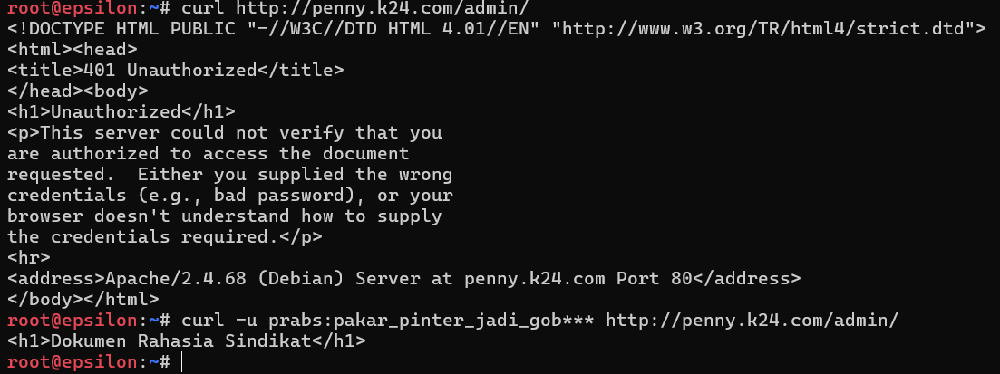
bisa dilihat kalau tidak menggunakan username prabs dan passwordnya maka tidak bisa mengakses isi dari dokumen rahasia sindikat.

13. Setiap entitas dari luar harus memanggil gerbang dengan nama kanoniknya. Jika ada yang mencoba mengakses IP penny dan domain  penny.xxx.com, paksa sistem untuk melakukan redirect secara permanen (status code 301) menuju www.xxx.com. Sebaliknya, jika ada yang mengakses IP abbey dan domain abbey.xxx.com, lakukan redirect sementara (status code 302) menuju static.xxx.com.

Pertama kami membuat script konfigurasi untuk masing-masing node penny dan abbey.

Konfigurasi penny:
```sh
#!/bin/bash

# Aktifkan modul alias (jika belum) untuk fungsionalitas redirect
a2enmod alias

cat << 'EOF' > /etc/apache2/sites-available/000-default.conf
# VHost 1: Menangkap akses IP dan penny.k24.com, lalu Redirect 301
<VirtualHost *:80>
    ServerName penny.k24.com
    # Karena ini VHost pertama, akses menggunakan IP juga akan masuk ke sini
    Redirect permanent / http://www.k24.com/
</VirtualHost>

# VHost 2: Layanan Utama menggunakan nama kanonik www.k24.com
<VirtualHost *:80>
    ServerName www.k24.com

    # --- Konfigurasi Soal 12 (Path /admin) ---
    ProxyPass /admin !
    <Location /admin>
        AuthType Basic
        AuthName "Restricted Area"
        AuthUserFile /etc/apache2/.htpasswd
        Require valid-user
    </Location>

    # --- Konfigurasi Soal 11 (Reverse Proxy Vault) ---
    <Proxy balancer://vault_cluster>
        BalancerMember http://obladi.k24.com
        BalancerMember http://desmond.k24.com
        ProxySet lbmethod=byrequests
    </Proxy>

    ProxyPreserveHost On
    RequestHeader set X-Real-IP "%{REMOTE_ADDR}s"

    ProxyPass / balancer://vault_cluster/
    ProxyPassReverse / balancer://vault_cluster/
</VirtualHost>
EOF

service apache2 restart
echo "Konfigurasi Redirect 301 Penny selesai!"
```
Kemudian konfigurasi untuk abbey:
```sh
#!/bin/bash

cat << 'EOF' > /etc/nginx/sites-available/default
upstream core_cluster {
    server oblada.k24.com;
    server molly.k24.com;
}

# Blok 1: Menangkap akses IP Abbey (default_server) dan abbey.k24.com
server {
    listen 80 default_server;
    listen [::]:80 default_server;
    server_name abbey.k24.com _; 
    
    # Melakukan redirect sementara (302)
    return 302 http://static.k24.com$request_uri;
}

# Blok 2: Layanan Utama menggunakan nama kanonik static.k24.com
server {
    listen 80;
    server_name static.k24.com;

    location / {
        proxy_pass http://core_cluster;
        
        proxy_set_header Host $host;
        proxy_set_header X-Real-IP $remote_addr;
        proxy_set_header X-Forwarded-For $proxy_add_x_forwarded_for;
    }
}
EOF

service nginx restart
echo "Konfigurasi Redirect 302 Abbey selesai!"
```

Selanjutnya tinggal dijalankan saja kedua script diatas. Ketika node lain mencoba mengakses domain penny dengan domain lama, maka akan muncul  output kalau domain dari IP penny telah dipindah. Hal ini juga berlaku untuk abbey, bedanya kalau penny dipindah permanen, sedangkan abbey dipindah sementara. Dapat dilihat pada gambar dibawah:

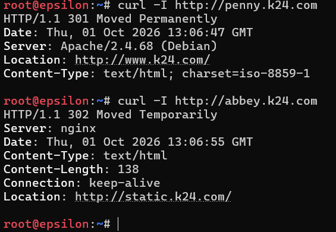

pada gambar diatas adalah hasil ketika kita mencoba mengakses domain yang lama.

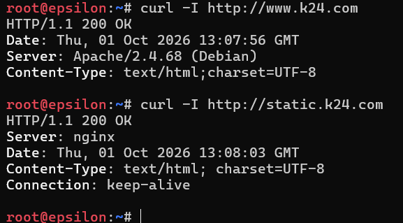

pada gambar diatas adalah hasil ketika kita mencoba mengakses domain yang baru.

14. Di dalam The Mesh, rekam jejak tidak boleh dipalsukan oleh sistem. Pastikan access log pada setiap server web di area vault maupun area core mencatat alamat IP asli milik client (pengunjung) yang diteruskan oleh gerbang, dan bukan mencatat IP dari Penny ataupun Abbey.

15. Rootkit menginstruksikan pembuatan jalur proxy khusus yang berdiri sendiri. Pada penny buat reverse proxy untuk path /eternal yang menyajikan directory /var/www/eternal, dan pastikan path ini dapat mengeksekusi (rendering) file php. Pada abbey, buat jalur /orion yang menyajikan directory /var/www/orion, secara murni statis tanpa perlu rendering php.

Pertama kami membuat script konfigurasi untuk masing-masing node penny dan abbey.

Node penny:
```sh
#!/bin/bash

# 1. Install PHP-FPM untuk rendering file PHP
apt-get update
apt-get install -y php-fpm

# 2. Aktifkan modul proxy FastCGI dan alias di Apache
a2enmod proxy_fcgi alias

# 3. Buat direktori dan file percobaan PHP
mkdir -p /var/www/eternal
echo "<?php echo '<h1>Jalur Eternal (PHP) Berjalan!</h1>'; ?>" > /var/www/eternal/index.php

# 4. Atur PHP-FPM agar mendengarkan di port TCP 9000 (menghindari error versi sock file)
sed -i 's|listen = /run/php/.*.sock|listen = 127.0.0.1:9000|g' /etc/php/*/fpm/pool.d/www.conf
service php*-fpm restart || /etc/init.d/php*-fpm restart

# 5. Tulis ulang konfigurasi VirtualHost
cat << 'EOF' > /etc/apache2/sites-available/000-default.conf
# Blok Redirect (Soal 13)
<VirtualHost *:80>
    ServerName penny.k24.com
    Redirect permanent / http://www.k24.com/
</VirtualHost>

# Blok Utama
<VirtualHost *:80>
    ServerName www.k24.com

    # --- KONFIGURASI SOAL 15 (Jalur Proxy Eternal PHP) ---
    # Tanda seru (!) berarti "jangan teruskan path ini ke load balancer"
    ProxyPass /eternal !
    Alias /eternal /var/www/eternal
    
    <Directory /var/www/eternal>
        Require all granted
        # Render file PHP dengan meneruskannya ke layanan lokal PHP-FPM
        <FilesMatch "\.php$">
            SetHandler "proxy:fcgi://127.0.0.1:9000"
        </FilesMatch>
    </Directory>
    
    # --- KONFIGURASI SOAL 12 (Jalur Admin) ---
    ProxyPass /admin !
    <Location /admin>
        AuthType Basic
        AuthName "Restricted Area"
        AuthUserFile /etc/apache2/.htpasswd
        Require valid-user
    </Location>

    # --- KONFIGURASI SOAL 11 (Load Balancer Vault) ---
    <Proxy balancer://vault_cluster>
        BalancerMember http://obladi.k24.com
        BalancerMember http://desmond.k24.com
        ProxySet lbmethod=byrequests
    </Proxy>

    ProxyPreserveHost On
    RequestHeader set X-Real-IP "%{REMOTE_ADDR}s"

    ProxyPass / balancer://vault_cluster/
    ProxyPassReverse / balancer://vault_cluster/
</VirtualHost>
EOF

service apache2 restart
echo "Konfigurasi /eternal di Penny selesai!"
```
Node abbey:
```sh
#!/bin/bash

# 1. Buat direktori statis dan file HTML murni
mkdir -p /var/www/orion
echo "<h1>Jalur Orion (Statis murni) Berjalan!</h1>" > /var/www/orion/index.html

# 2. Tulis ulang konfigurasi Nginx
cat << 'EOF' > /etc/nginx/sites-available/default
upstream core_cluster {
    server oblada.k24.com;
    server molly.k24.com;
}

# Blok Redirect (Soal 13)
server {
    listen 80 default_server;
    listen [::]:80 default_server;
    server_name abbey.k24.com _; 
    return 302 http://static.k24.com$request_uri;
}

# Blok Utama
server {
    listen 80;
    server_name static.k24.com;

    # --- KONFIGURASI SOAL 15 (Jalur Statis Orion) ---
    location /orion/ {
        alias /var/www/orion/;
        index index.html;
    }

    # --- KONFIGURASI SOAL 11 (Load Balancer Core) ---
    location / {
        proxy_pass http://core_cluster;
        
        proxy_set_header Host $host;
        proxy_set_header X-Real-IP $remote_addr;
        proxy_set_header X-Forwarded-For $proxy_add_x_forwarded_for;
    }
}
EOF

service nginx restart
echo "Konfigurasi /orion di Abbey selesai!"
```

Kemudian cara akses ke path eternal menggunakan `curl http://www.k24.com/eternal/` dan orion menggunakan `curl http://static.k24.com/orion/`. Untuk hasilnya sebagai berikut:

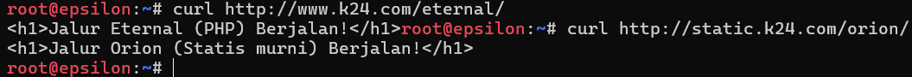
Bisa dilihat pada gambar kalau akses menuju ke path eternal maupun orion berhasil.

16. Ketahanan gerbang The Mesh harus diuji untuk menghadapi bombardir permintaan. Salah satu Klien (misal: Alpha) bertugas melakukan stress test benchmark menggunakan ApacheBench. Lakukan 250 requests dengan tingkat konkurensi (concurrencies) 10 untuk masing - masing titik akhir: www.xxx.com dan static.xxx.com. Tampilkan rangkuman hasilnya.

Pada node klien lakukan command `apt-get update` dan 
`apt-get install -y apache2-utils` untuk melakukan instalasi ApacheBench. Setelah instalasi lakukan command `ab -n 250 -c 10 http://www.k24.com/` dan `ab -n 250 -c 10 http://static.k24.com/` untuk mengetahui berapa complete requestnya, berapa failed requestnya, request per secondnya, dan time taken for test. Berikut adalah hasilnya:

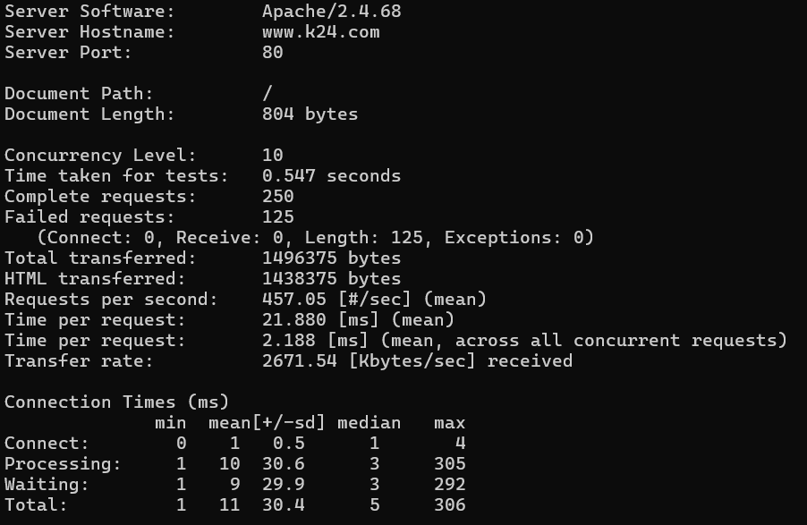
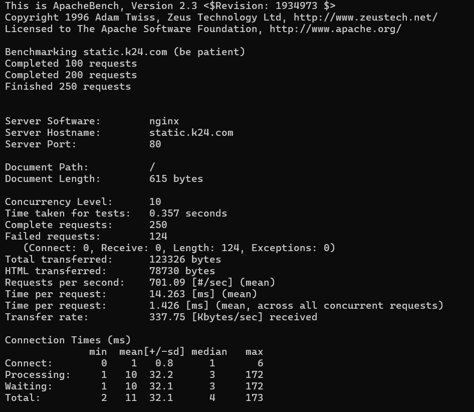

17. Tambahkan TXT record pada DNS untuk semua klien sayap kiri dan sayap kanan (Alpha, Beta, Gamma, Delta, Epsilon). Jika DNS di-query TXT terhadap nama domain mereka (contoh: alpha.<xxxx>.com), sistem harus mengembalikan teks berupa nama hostname mereka masing-masing (contoh: "alpha").

Ini adalah hasilnya:

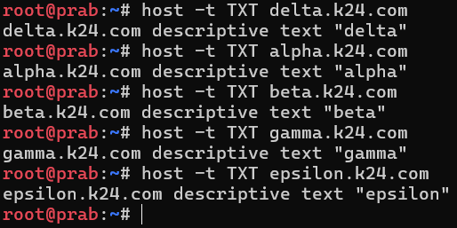

18. Ubah A record DNS milik abbey.xxx.com ke alamat IP yang fiktif (ubah secara random namun pastikan format IP valid). Naikkan nilai serial SOA di prab dan pastikan tedd ikut tersinkron. Tetapkan TTL sebesar 15 detik pada record yang relevan tersebut. Verifikasi momen yang terjadi pada tiga fase pencarian: sebelum perubahan terjadi (mengembalikan IP lama), saat perubahan baru saja terjadi dalam jeda 15 detik (masih IP lama karena cache), dan setelah batas waktu TTL habis (berubah ke IP fiktif yang baru).

Pertama lakukan penggantian pada folder `/etc/bind/db.k24`. 

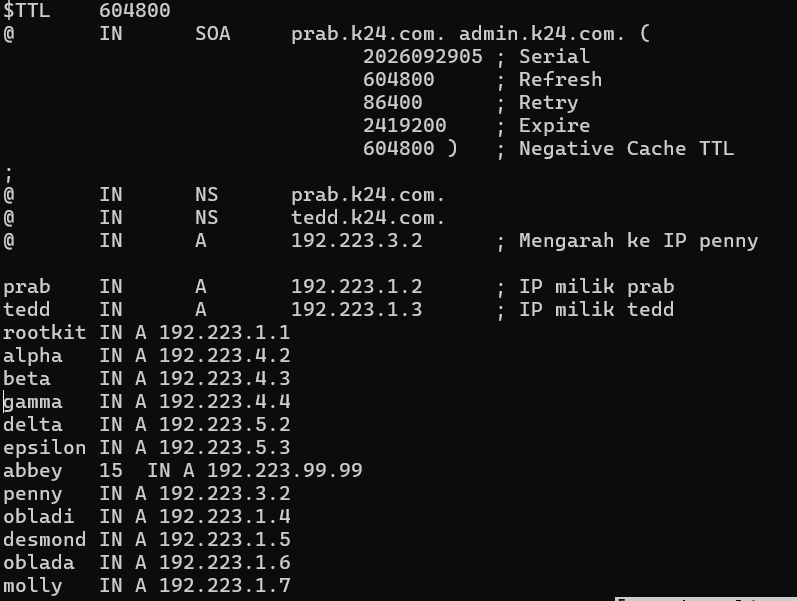

Kemudian pada baris abbey, lakukan penggantian IP dengan IP baru dan berikan jeda selama 15 detik.

Ini adalah IP sebelum diganti:

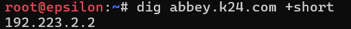

Ini adalah IP sesudah diganti:

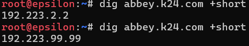

pada gambar sesudah diganti, kami mencoba melakukan pengulangan restart karena ketika kami lakukan restart untuk percobaan cache selama 15 detik, tidak ada jeda sama sekali sesaat setelah IP diperbarui sehingga ketika dilakukan uji coba hasilnya langsung menunjukkan IP baru dan tidak ada delay selama 15 detik setelah dilakukan restart. Kami mengasumsikan kalau melakukan jeda setelah IP diperbarui itu memang tidak bisa.

19. Last? But not least? Buat CNAME record yang melakukan binding dari domain internal outbound.xxx.com menuju domain eksternal http.badssl.com, Lakukan perintah curl ke http://outbound.xxx.com dan pastikan output yang dihasilkan sesuai dengan isi konten di halaman http.badssl.com.

Ini adalah hasilnya:

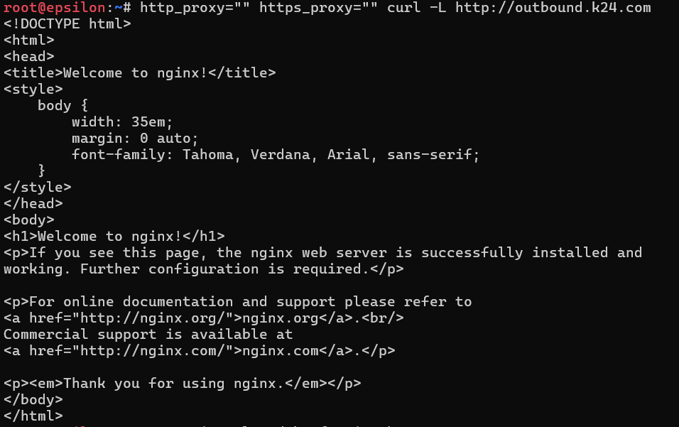

20. Setelah semua penyelesaian selesai, pastikan semua service dan konfigurasi yang telah dikerjakan dari awal tetap berjalan normal dan berstatus autostart saat node di-restart (khusus untuk kasus ini, abaikan konfigurasi nomor 18 dan biarkan koordinat kembali normal).

Untuk nomor 20 kita cukup restart saja nodenya.