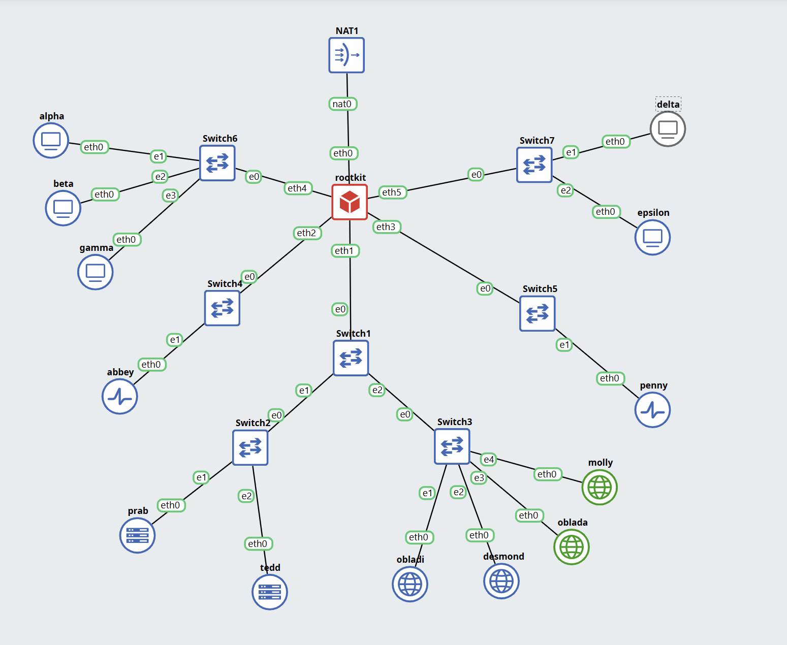

# Jarkom-Modul-2-2026-K-24

## Member   

| Nama                      | NRP        |
| ------------------------- | ---------- |
| Wildan Alfarezy       | 5027251088 |
| Ashkhabil Abror Budihardjo | 5027251049 |

## Laporan

1. Pertama kita melakukan setup topology nya terlebbih dahulu mulai dari rootkit lalu lima gerbang utama (Switch), operator (alpha, beta, gamma), penjaga directory (prab, tedd), gerbang penyaring (abbey, penny), hingga repository (obladi, desmond, oblada, molly).



2. Setelah itu melakukan Konfigurasikan NAT agar dapat meneruskan lalu lintas keluar bagi seluruh alamat internal, sehingga semua host di dalam jaringan dapat menjangkau internet publik menggunakan IP address. dengan membuat script di `config.sh` 

rootkit:
```sh
#!/bin/bash

# 1. Pancing koneksi internet secara MANUAL (Bypass dhclient)
ip link set eth0 up
ip addr flush dev eth0
ip addr add 192.168.122.250/24 dev eth0
ip route add default via 192.168.122.1
echo "nameserver 8.8.8.8" > /etc/resolv.conf

# 2. Update server dan instal alat yang hilang (sekarang pasti bisa karena ada internet)
apt-get update
DEBIAN_FRONTEND=noninteractive apt-get install -y ifupdown isc-dhcp-client iptables iptables-persistent

# 3. Tulis konfigurasi IP permanen
cat <<EOF > /etc/network/interfaces
auto lo
iface lo inet loopback

# Antarmuka NAT (sekarang isc-dhcp-client sudah terinstal)
auto eth0
iface eth0 inet dhcp

# Antarmuka Klien (Gunakan Prefix IP Kelompokmu)
auto eth1
iface eth1 inet static
    address 192.223.1.1
    netmask 255.255.255.0

auto eth2
iface eth2 inet static
    address 192.223.2.1
    netmask 255.255.255.0

auto eth3
iface eth3 inet static
    address 192.223.3.1
    netmask 255.255.255.0

auto eth4
iface eth4 inet static
    address 192.223.4.1
    netmask 255.255.255.0

auto eth5
iface eth5 inet static
    address 192.223.5.1
    netmask 255.255.255.0
EOF

# 4. Restart jaringan menggunakan ifupdown yang baru diinstal
ifdown -a && ifup -a

# 5. Aktifkan Routing dan NAT
echo 1 > /proc/sys/net/ipv4/ip_forward
iptables -t nat -A POSTROUTING -o eth0 -j MASQUERADE
netfilter-persistent save

echo "Konfigurasi Rootkit Selesai!"
```
alpha:
```sh
#!/bin/bash
ip link set eth0 up
ip addr flush dev eth0
ip addr add 192.223.4.2/24 dev eth0
ip route add default via 192.223.4.1
echo "nameserver 192.168.122.1" > /etc/resolv.conf

apt-get update
DEBIAN_FRONTEND=noninteractive apt-get install -y ifupdown

cat <<EOF > /etc/network/interfaces
auto lo
iface lo inet loopback

auto eth0
iface eth0 inet static
    address 192.223.4.2
    netmask 255.255.255.0
    gateway 192.223.4.1
EOF
echo "Konfigurasi alpha selesai!"
```
beta:
```sh
#!/bin/bash
ip link set eth0 up
ip addr flush dev eth0
ip addr add 192.223.4.3/24 dev eth0
ip route add default via 192.223.4.1
echo "nameserver 192.168.122.1" > /etc/resolv.conf

apt-get update
DEBIAN_FRONTEND=noninteractive apt-get install -y ifupdown

cat <<EOF > /etc/network/interfaces
auto lo
iface lo inet loopback

auto eth0
iface eth0 inet static
    address 192.223.4.3
    netmask 255.255.255.0
    gateway 192.223.4.1
EOF
echo "Konfigurasi beta selesai!"
```
gamma:
```sh
#!/bin/bash
ip link set eth0 up
ip addr flush dev eth0
ip addr add 192.223.4.4/24 dev eth0
ip route add default via 192.223.4.1
echo "nameserver 192.168.122.1" > /etc/resolv.conf

apt-get update
DEBIAN_FRONTEND=noninteractive apt-get install -y ifupdown

cat <<EOF > /etc/network/interfaces
auto lo
iface lo inet loopback

auto eth0
iface eth0 inet static
    address 192.223.4.4
    netmask 255.255.255.0
    gateway 192.223.4.1
EOF
echo "Konfigurasi gamma selesai!"
```
delta:
```sh
#!/bin/bash
ip link set eth0 up
ip addr flush dev eth0
ip addr add 192.223.5.2/24 dev eth0
ip route add default via 192.223.5.1
echo "nameserver 192.168.122.1" > /etc/resolv.conf

apt-get update
DEBIAN_FRONTEND=noninteractive apt-get install -y ifupdown

cat <<EOF > /etc/network/interfaces
auto lo
iface lo inet loopback

auto eth0
iface eth0 inet static
    address 192.223.5.2
    netmask 255.255.255.0
    gateway 192.223.5.1
EOF
echo "Konfigurasi delta selesai!"
```
epsilon:
```sh
#!/bin/bash
ip link set eth0 up
ip addr flush dev eth0
ip addr add 192.223.5.3/24 dev eth0
ip route add default via 192.223.5.1
echo "nameserver 192.168.122.1" > /etc/resolv.conf

apt-get update
DEBIAN_FRONTEND=noninteractive apt-get install -y ifupdown

cat <<EOF > /etc/network/interfaces
auto lo
iface lo inet loopback

auto eth0
iface eth0 inet static
    address 192.223.5.3
    netmask 255.255.255.0
    gateway 192.223.5.1
EOF
echo "Konfigurasi epsilon selesai!"
```
abbey:
```sh
#!/bin/bash
ip link set eth0 up
ip addr flush dev eth0
ip addr add 192.223.2.2/24 dev eth0
ip route add default via 192.223.2.1
echo "nameserver 192.168.122.1" > /etc/resolv.conf

apt-get update
DEBIAN_FRONTEND=noninteractive apt-get install -y ifupdown

cat <<EOF > /etc/network/interfaces
auto lo
iface lo inet loopback

auto eth0
iface eth0 inet static
    address 192.223.2.2
    netmask 255.255.255.0
    gateway 192.223.2.1
EOF
echo "Konfigurasi abbey selesai!"
```
penny:
```sh
#!/bin/bash
ip link set eth0 up
ip addr flush dev eth0
ip addr add 192.223.3.2/24 dev eth0
ip route add default via 192.223.3.1
echo "nameserver 192.168.122.1" > /etc/resolv.conf

apt-get update
DEBIAN_FRONTEND=noninteractive apt-get install -y ifupdown

cat <<EOF > /etc/network/interfaces
auto lo
iface lo inet loopback

auto eth0
iface eth0 inet static
    address 192.223.3.2
    netmask 255.255.255.0
    gateway 192.223.3.1
EOF
echo "Konfigurasi penny selesai!"
```
prab:
```sh
#!/bin/bash
ip link set eth0 up
ip addr flush dev eth0
ip addr add 192.223.1.2/24 dev eth0
ip route add default via 192.223.1.1
echo "nameserver 192.168.122.1" > /etc/resolv.conf

apt-get update
DEBIAN_FRONTEND=noninteractive apt-get install -y ifupdown

cat <<EOF > /etc/network/interfaces
auto lo
iface lo inet loopback

auto eth0
iface eth0 inet static
    address 192.223.1.2
    netmask 255.255.255.0
    gateway 192.223.1.1
EOF
echo "Konfigurasi prab selesai!"
```
tedd:
```sh
#!/bin/bash
ip link set eth0 up
ip addr flush dev eth0
ip addr add 192.223.1.3/24 dev eth0
ip route add default via 192.223.1.1
echo "nameserver 192.168.122.1" > /etc/resolv.conf

apt-get update
DEBIAN_FRONTEND=noninteractive apt-get install -y ifupdown

cat <<EOF > /etc/network/interfaces
auto lo
iface lo inet loopback

auto eth0
iface eth0 inet static
    address 192.223.1.3
    netmask 255.255.255.0
    gateway 192.223.1.1
EOF
echo "Konfigurasi tedd selesai!"
```
obladi:
```sh
#!/bin/bash
ip link set eth0 up
ip addr flush dev eth0
ip addr add 192.223.1.4/24 dev eth0
ip route add default via 192.223.1.1
echo "nameserver 192.168.122.1" > /etc/resolv.conf

apt-get update
DEBIAN_FRONTEND=noninteractive apt-get install -y ifupdown

cat <<EOF > /etc/network/interfaces
auto lo
iface lo inet loopback

auto eth0
iface eth0 inet static
    address 192.223.1.4
    netmask 255.255.255.0
    gateway 192.223.1.1
EOF
echo "Konfigurasi obladi selesai!"
```
desmond:
```sh
#!/bin/bash
ip link set eth0 up
ip addr flush dev eth0
ip addr add 192.223.1.5/24 dev eth0
ip route add default via 192.223.1.1
echo "nameserver 192.168.122.1" > /etc/resolv.conf

apt-get update
DEBIAN_FRONTEND=noninteractive apt-get install -y ifupdown

cat <<EOF > /etc/network/interfaces
auto lo
iface lo inet loopback

auto eth0
iface eth0 inet static
    address 192.223.1.5
    netmask 255.255.255.0
    gateway 192.223.1.1
EOF
echo "Konfigurasi desmond selesai!"
```
oblada:
```sh
#!/bin/bash
ip link set eth0 up
ip addr flush dev eth0
ip addr add 192.223.1.6/24 dev eth0
ip route add default via 192.223.1.1
echo "nameserver 192.168.122.1" > /etc/resolv.conf

apt-get update
DEBIAN_FRONTEND=noninteractive apt-get install -y ifupdown

cat <<EOF > /etc/network/interfaces
auto lo
iface lo inet loopback

auto eth0
iface eth0 inet static
    address 192.223.1.6
    netmask 255.255.255.0
    gateway 192.223.1.1
EOF
echo "Konfigurasi oblada selesai!"
```
molly:
```sh
#!/bin/bash
ip link set eth0 up
ip addr flush dev eth0
ip addr add 192.223.1.7/24 dev eth0
ip route add default via 192.223.1.1
echo "nameserver 192.168.122.1" > /etc/resolv.conf

apt-get update
DEBIAN_FRONTEND=noninteractive apt-get install -y ifupdown

cat <<EOF > /etc/network/interfaces
auto lo
iface lo inet loopback

auto eth0
iface eth0 inet static
    address 192.223.1.7
    netmask 255.255.255.0
    gateway 192.223.1.1
EOF
echo "Konfigurasi molly selesai!"
```
3. untuk soal nomer 3 kami sudah menjadikan satu script di soal dua tadi. jadi untuk menghindari fragmentasi saat persiapan, pastikan setiap host non-router menambahkan resolver 192.168.122.1 di tambah di file /etc/resolv.conf kami lakukan di `config.sh` pada setiap client.

pada tiap client:
```sh
echo "nameserver 192.168.122.1" > /etc/resolv.conf
```
4. Selanjutnya Pada node prab, bangun zona `<xxxx>.com` sebagai authoritative dengan SOA yang menunjuk ke `prab.<xxxx>.com`, serta tambahkan catatan NS untuk `prab.<xxxx>`.com dan`tedd.<xxxx>.com`. untuk `prab.<xxxx>.com` dan `tedd.<xxxx>.com` yang mengarah ke alamat IP mereka masing-masing sedangkan `<xxxx>.com` mengarah ke gerbang aplikasi dinamis (penny).

## langkah pertama kami lakukan konfigurasi di prab (master)

buat scrift dengan nama `nomer4.sh` di node prab:
```sh
#!/bin/bash

# 1. Instal aplikasi DNS Server (BIND9) dan alat pengujian
apt-get update
DEBIAN_FRONTEND=noninteractive apt-get install -y bind9 bind9utils bind9-doc dnsutils

# 2. Konfigurasi Forwarders ke 192.168.122.1
cat <<EOF > /etc/bind/named.conf.options
options {
        directory "/var/cache/bind";
        forwarders {
                192.168.122.1;
        };
        forward only;
        dnssec-validation auto;
        listen-on-v6 { any; };
        allow-query { any; };
};
EOF

# 3. Deklarasi Zona Master untuk k24.com
cat <<EOF > /etc/bind/named.conf.local
zone "k24.com" {
        type master;
        file "/etc/bind/db.k24";
        allow-transfer { 192.223.1.3; };  # Mengizinkan transfer ke IP tedd
        notify yes;
};
EOF

# 4. Membuat File Zona (Data Domain)
cat <<EOF > /etc/bind/db.k24
\$TTL    604800
@       IN      SOA     prab.k24.com. admin.k24.com. (
                              2026092901 ; Serial
                              604800     ; Refresh
                              86400      ; Retry
                              2419200    ; Expire
                              604800 )   ; Negative Cache TTL
;
@       IN      NS      prab.k24.com.
@       IN      NS      tedd.k24.com.
@       IN      A       192.223.3.2      ; Mengarah ke IP penny

prab    IN      A       192.223.1.2      ; IP milik prab
tedd    IN      A       192.223.1.3      ; IP milik tedd
EOF

# 5. Nyalakan layanan BIND9 langsung dari program intinya
/usr/sbin/named -u bind

# 6. Perbarui urutan resolver prab
cat <<EOF > /etc/resolv.conf
nameserver 192.223.1.2
nameserver 192.223.1.3
nameserver 192.168.122.1
EOF

echo "Konfigurasi prab sebagai Master DNS untuk k24.com selesai!"
```
## langkah kedua kami melakukan konfigurasi di tedd (slave)

buat scrift dengan nama `nomer4.sh` juga tapi di node tedd:
```sh
#!/bin/bash

# 1. Instal aplikasi DNS Server
apt-get update
DEBIAN_FRONTEND=noninteractive apt-get install -y bind9 bind9utils bind9-doc dnsutils

# 2. Konfigurasi Forwarders ke internet (192.168.122.1)
cat <<EOF > /etc/bind/named.conf.options
options {
        directory "/var/cache/bind";
        forwarders {
                192.168.122.1;
        };
        forward only;
        dnssec-validation auto;
        listen-on-v6 { any; };
        allow-query { any; };
};
EOF

# 3. Deklarasi Zona Slave yang disalin dari prab (Master)
cat <<EOF > /etc/bind/named.conf.local
zone "k24.com" {
        type slave;
        masters { 192.223.1.2; };        # Menunjuk ke IP milik prab
        file "/var/cache/bind/db.k24";   # Disimpan di sini agar sistem diizinkan menulis data salinan
};
EOF

# 4. Nyalakan layanan BIND9 langsung dari program intinya
/usr/sbin/named -u bind

# 5. Perbarui urutan resolver tedd agar bisa mengetes domain
cat <<EOF > /etc/resolv.conf
nameserver 192.223.1.2
nameserver 192.223.1.3
nameserver 192.168.122.1
EOF

echo "Konfigurasi tedd sebagai Slave DNS untuk k24.com selesai!"
```

setelah itu kita script untuk semua node selain prab dan tedd untuk perbarui urutan resolver pada seluruh Entitas non-router menjadi: IP prab, IP tedd, lalu 192.168.122.1.

```sh
#!/bin/bash

# Memperbarui urutan resolver untuk klien
cat <<EOF > /etc/resolv.conf
nameserver 192.223.1.2
nameserver 192.223.1.3
nameserver 192.168.122.1
EOF

echo "DNS Resolver klien berhasil diperbarui!"
```
5. 